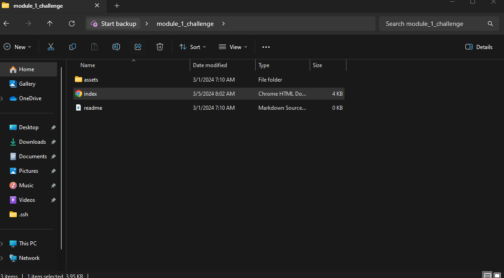

# Module 1 Challenge

## Description

The goal of this project was to refactor an already existing website to make it more accesible.  This included adding alt tags to all images, and adding semantic HTML elements where needed to make the Codebase more readable.  I learned many different HTML semantic tags, while also learning how to simplify many seperate IDs into common classes.  Thus simplfying the CSS.

[Link to deployed Github website](https://jakerasmusson.github.io/module_1_challenge/#social-media-marketing)

## Installation

Select index.html to open the webpage.

## Usage

Below is a screenshot of the location of the index.html file to open the webpage.

Below is an example of what to expect when you open the webpage.

## Credits

Below I have the Repository that provided the source code.

[Starter code](https://github.com/coding-boot-camp/urban-octo-telegram)

Shout out to Josh Nailor for teaching me the skills in this repo.